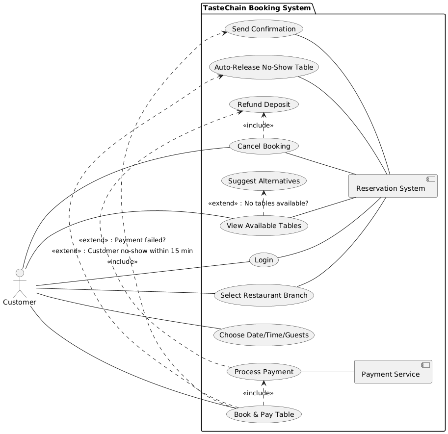
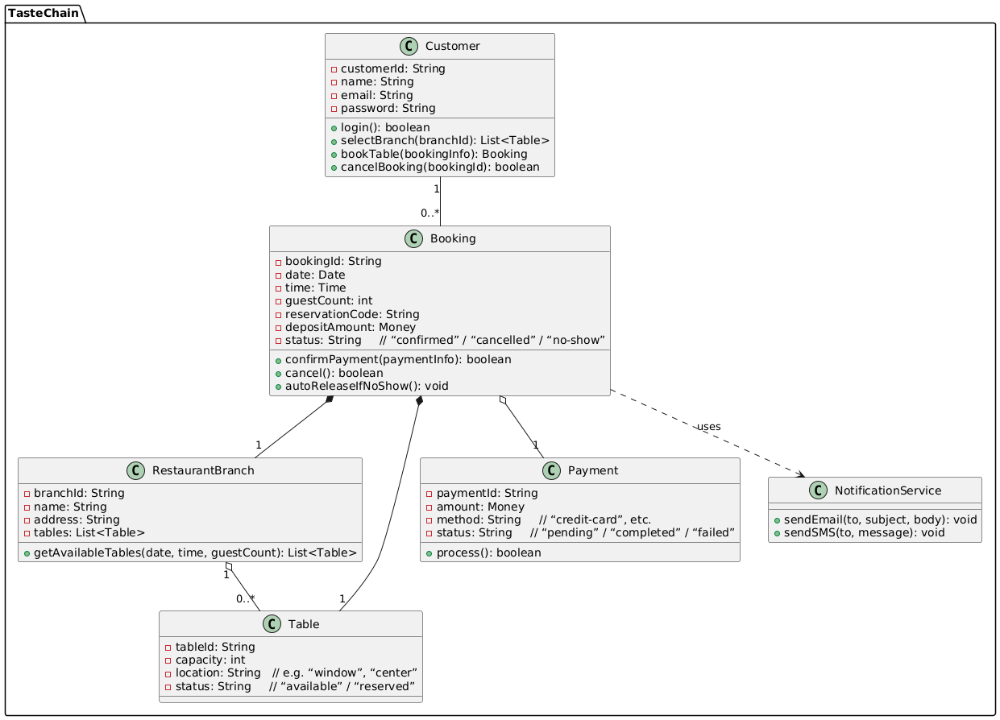

# Use Case: Book and Pay for Table

## Scenario

Ethan is an international student who wants to book a table at “TasteChain” restaurants before meeting his friends. He opens the TasteChain mobile app and logs in. On the home screen, he selects the restaurant branch near campus. Next, he picks a date (May 20), a time (6:00 PM), and the number of guests (4). The app shows available tables and a small deposit cost. Ethan chooses a table by the window and taps “Pay Deposit.” He enters his credit‐card details and confirms. The app processes his payment, then shows a booking confirmation with a reservation code. Ethan receives an email and SMS with the code and details. On the day, he arrives at the restaurant, shows his code at the host stand, and enjoys dinner with his friends.

## Use Case Description

- **Use Case Name:** Book and Pay for Table  
- **Primary Actor:** Customer (registered user)  
- **Supporting Actors:** Payment Service, Restaurant Reservation System  

## Preconditions

- Customer has created an account and is logged in  
- Restaurant branch has available tables  

## Main Flow (Success Scenario)

1. Customer opens the app and logs in  
2. Customer selects a restaurant branch  
3. Customer chooses date, time, and number of guests  
4. System displays available tables and deposit amount  
5. Customer selects a table and taps “Pay Deposit”  
6. System redirects to Payment Service  
7. Customer enters payment details and confirms  
8. Payment Service approves and sends confirmation to System  
9. System creates booking and shows confirmation with reservation code  
10. System sends booking details via email and SMS  

## Postconditions

- A table is reserved for the chosen date/time  
- Deposit is recorded and held until customer arrives  
- Customer has a reservation code to present at the restaurant  

## Alternative Flows

- **4a. No tables available**  
  System shows “No tables available” and suggests next possible time or date  

- **7a. Payment failed**  
  Payment Service returns an error; system shows “Payment failed, please try again or use another card”  

## Extensions

- Customer can cancel booking up to 2 hours before and receive a full refund of the deposit  
- System automatically releases the table if the customer does not arrive within 15 minutes of the booking time

## Diagrams

  
